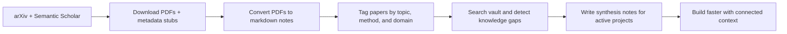

# second-brain-pipeline

A Python pipeline that turns scattered research papers into an explorable Obsidian knowledge vault: download from arXiv, convert to markdown, tag themes, and surface connections you can actually reuse in projects.

No API keys required. Both arXiv and Semantic Scholar are public APIs.

---

## Why This Project Is Interesting

Most research tooling stops at "collect papers." This project goes one step further:

- It turns papers into reusable markdown notes instead of a folder of forgotten PDFs.
- It builds structured metadata so topics, methods, and gaps become searchable.
- It supports an actual research loop: collect -> connect -> synthesize -> build.

The core idea is simple: this repo shows how I design systems that transform messy information into something operational and decision-ready.

---

## Workflow At A Glance



The pipeline is opinionated: read fewer papers, connect them better, and preserve the useful parts for future work.

---

## Example Outcome

Here is the kind of workflow this repo is built for:

1. Start with a problem like "diffusion models for time-series forecasting."
2. Download recent, high-signal papers from arXiv.
3. Convert them into markdown notes inside Obsidian.
4. Auto-tag recurring ideas such as `diffusion-models`, `time-series`, `forecasting`, and `uncertainty`.
5. Search the vault later and immediately see related methods, missing areas, and adjacent topics worth exploring.

Instead of re-researching from scratch, the vault becomes a connected map of what you already know.

---

## What It Does

```
arXiv API + Semantic Scholar
        ↓
arxiv_downloader.py   →  PDFs + metadata stubs
        ↓
pdf_to_md.py          →  markdown notes
        ↓
tag_metadata.py       →  enriched metadata tags
        ↓
vault_search.py       →  search, gap analysis, project-aware filtering
```

Papers are filtered by citation count (default: ≥20) so you only read high-signal work.

---

## Best Way To Experience It

The most compelling presentation is not a long workflow document by itself. For this project, the strongest combination is:

1. A short visual overview in this README.
2. One concrete example showing how a paper moves through the system.
3. A short GIF or screenshot set showing the Obsidian graph, tags, and search flow.
4. The deeper technical reference in `docs/workflow.md`.

If you add media, focus on the "aha" moment:

- tagging a new paper
- seeing linked notes appear
- running a search or gap check
- opening the graph view to show connected topics

That tells the story faster than a text-only process diagram.

---

## Setup

```bash
pip install -r requirements.txt
```

Configure your topics in `config/topics.yaml`. The file ships with 200+ curated search queries across ML, statistics, optimization, and quantitative finance — organized by research area.

---

## Quick Start

```bash
# Preview what would be downloaded (no files written)
make download-dry

# Download papers
make download

# Convert PDFs to markdown
make convert

# Tag metadata cards
make tag

# Search
make search QUERY="diffusion models"

# Find knowledge gaps
make gaps TOPIC="reinforcement learning"
```

---

## Vault Folder Layout

The scripts expect (and create) this structure relative to the repo root:

```
second-brain-pipeline/
├── scripts/arxiv_pdfs/{topic}/    # downloaded PDFs
├── 10-Knowledge/
│   ├── arxiv_mds/{topic}/         # converted markdown notes
│   └── metadata/                  # YAML metadata cards (one per paper)
```

Works well with [Obsidian](https://obsidian.md) — open the repo root as your vault.

---

## Configuration

Edit `config/topics.yaml` to customize:

- **`defaults`** — max papers per topic, min citations, days back, API rate limits
- **`categories`** — arXiv category filters (cs.LG, stat.ML, q-fin.*, etc.)
- **`topics`** — search query strings, organized by research area

```yaml
defaults:
  max_papers: 10
  min_citations: 20
  days_back: 365

topics:
  my_area:
    - "your search query here"
    - "another query"
```

---

## Scripts

| Script | What it does |
|--------|-------------|
| `arxiv_downloader.py` | Downloads PDFs + writes metadata stubs. Reads topics from `config/topics.yaml`. |
| `pdf_to_md.py` | Converts PDFs to markdown notes. |
| `tag_metadata.py` | Enriches metadata cards with content-based tags. |
| `vault_search.py` | Search by tag/query/citation, identify knowledge gaps, export results. |

See [docs/workflow.md](docs/workflow.md) for the full step-by-step workflow and project loop.

---

## CLI Reference

```bash
# Download
python3 scripts/arxiv_downloader.py --topic "diffusion models" --max 20 --min-citations 50
python3 scripts/arxiv_downloader.py --category cs.LG --days 90 --dry-run

# Search
python3 scripts/vault_search.py --query "factor model" --top 10
python3 scripts/vault_search.py --tags quant-finance --min-citations 50
python3 scripts/vault_search.py --query "returns" --deep        # full text search
python3 scripts/vault_search.py --gaps stock-prediction         # knowledge gap report
python3 scripts/vault_search.py --gaps-init "crypto investing"  # auto-generate map
python3 scripts/vault_search.py --audit                         # vault health check

# Tag
python3 scripts/tag_metadata.py --suggest --apply
python3 scripts/tag_metadata.py --audit
```

---

## Tests

```bash
make test
# or
pytest scripts/
```
