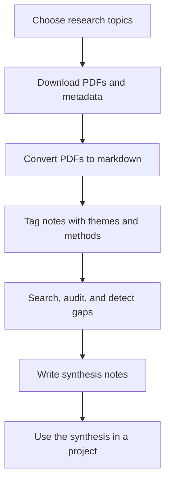

# Research Workflow

A step-by-step guide to using the pipeline once you want the implementation details.

This document is the technical companion to the main [README](../README.md). The README should sell the idea quickly; this file should help someone reproduce the workflow.

---

## Setup

```bash
pip install -r requirements.txt
```

Configure your topic areas in `config/topics.yaml` — add, remove, or edit search queries and arXiv categories to match your research focus.

---

## End-To-End Flow



---

## Pipeline Steps

### 1. Download Papers

```bash
# Download papers for all topics in config/topics.yaml
make download

# Preview what would be downloaded (no API calls beyond arXiv)
make download-dry

# Single topic
python3 scripts/arxiv_downloader.py --topic "diffusion models" --max 20 --min-citations 50

# Single arXiv category
python3 scripts/arxiv_downloader.py --category cs.LG --days 90
```

Papers are saved to `scripts/arxiv_pdfs/{topic_slug}/`. Metadata stubs (YAML frontmatter) go to `10-Knowledge/metadata/`. A download log at `scripts/_download_log.json` prevents re-downloading.

### 2. Convert PDFs to Markdown

```bash
make convert
# or
python3 scripts/pdf_to_md.py
```

Converts PDFs in `scripts/arxiv_pdfs/` to readable markdown notes in `10-Knowledge/arxiv_mds/`. One `.md` per paper.

### 3. Tag Metadata Cards

```bash
make tag
# or
python3 scripts/tag_metadata.py --suggest --apply
```

Walks `10-Knowledge/metadata/` and enriches each card with content-based tags derived from the abstract.

Other modes:
```bash
python3 scripts/tag_metadata.py --audit     # report tag health without writing
python3 scripts/tag_metadata.py --synonyms  # check for split/synonym tag issues
```

### 4. Search the Vault

```bash
make search QUERY="factor model"
# or
python3 scripts/vault_search.py --query "factor model" --top 10
python3 scripts/vault_search.py --tags quant-finance --min-citations 50
python3 scripts/vault_search.py --query "cross-sectional returns" --deep   # full text search
```

---

## Concrete Example

If you were exploring "diffusion models for finance," the workflow would look like this:

1. Add a diffusion-finance query in `config/topics.yaml`.
2. Run `make download` to collect papers and metadata stubs.
3. Run `make convert` to create markdown notes in the vault.
4. Run `make tag` so methods and domains become searchable tags.
5. Run `make search QUERY="diffusion"` or `make gaps TOPIC="diffusion models for finance"` to inspect coverage.
6. Open the vault in Obsidian and use graph view to see how the new notes connect to adjacent topics like forecasting, uncertainty, or generative modeling.

This is usually easier to understand than a purely abstract workflow.

---

## Knowledge Gap Analysis

Find what research is missing for a topic:

```bash
# Check gaps for a known topic area
python3 scripts/vault_search.py --gaps stock-prediction

# Auto-generate a knowledge map from any problem description
make gaps TOPIC="anomaly detection for network security"
# or
python3 scripts/vault_search.py --gaps-init "anomaly detection for network security"
```

`--gaps` reports ✅ strong / 🟡 weak / ❌ missing coverage and outputs exact download commands to fill gaps.

---

## Project Workflow

When starting a new research project:

1. **Map the problem.** `--gaps-init "your problem"` auto-generates a knowledge map.
2. **Check gaps.** `--gaps {problem}` shows what research is missing. Fill gaps before building.
3. **Search → Read → Synthesize → Build.**
   - `vault_search.py` filters papers
   - Read 3–5 top-cited matches (not 50)
   - Write a synthesis note answering ONE design question
   - Generate code from the synthesis note, not directly from papers
4. **Start with the simplest baseline.** Failure tells you whether the problem is target, features, or model.
5. **Log everything.** Every experiment gets a row in a results table with key findings.

---

## Vault Folder Layout

```
your-vault/
├── 10-Knowledge/
│   ├── arxiv_mds/{topic}/     # converted markdown notes
│   └── metadata/              # YAML metadata cards (one per paper)
├── 20-Notes/
│   ├── synthesis/             # design decisions grounded in papers
│   └── daily/                 # scratchpad and roadmap
└── 30-Projects/active/        # active research projects
```

---

## Reinforcement Knowledge Loop

```
gaps-init → gaps → download → convert → tag → gaps again → synthesize → build → log
```

Every project makes the vault stronger for all future projects.

---

## Presentation Suggestions

If you want to make this repo more connectable for recruiters or collaborators, the best additions are:

- A short GIF of papers entering the vault, receiving tags, and appearing in the Obsidian graph.
- A screenshot trio showing a markdown note, metadata tags, and the resulting graph connections.
- A small "example project" section in the README that follows one topic from search query to reusable synthesis.

The key is to show the transformation, not just describe it.
